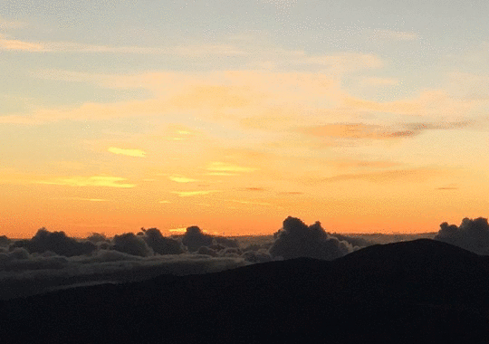
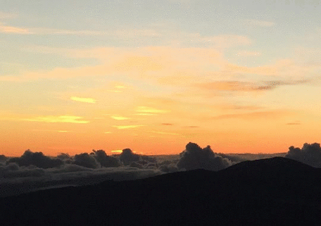
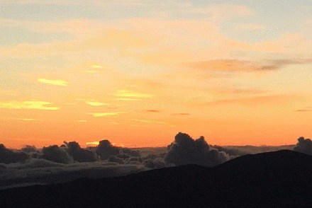
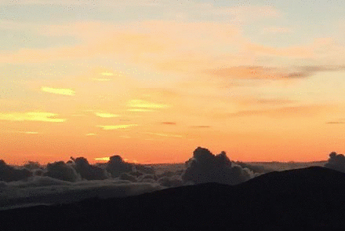

# Rotoscoping

simple rotoscoping effect with [imagemagick](http://www.imagemagick.org) and [ffmpeg](http://ffmpeg.org/).

(gifs here are a little bit too large (max is 3.7MB, average ~1.2MB), be patient 😉).

## Example 1

### Original (5s)

### Result (5s)

### How to 
- extract frames from your video 
- compose new frames like this : 

| new video frames | composition           |
| ---------------- |:---------------------:| 
| frame 1          | frame 1               |
| frame 2          | frame 2               |
| frame 3          | frame 3               |
| ...              | ...                   |
| frame x          | frame x + frame 1     |
| frame (x+1)      | frame (x+1) + frame 2 |
| frame (x+2)      | frame (x+2) + frame 3 |
| ...              | ...                   |
- create video from new frames

## Example 2

### Original (30s)

### Result (15s)

### How to 
- split by 2 your video into 2 videos with same length of time (part1, part2)
- extract frames from the 2 new videos 
- compose new frames like this : 

| new video frames | composition                                           |
| ---------------- |:-----------------------------------------------------:| 
| frame 1          | (frame 1 from part1) + (frame 1 from part2)           |
| frame 2          | (frame 2 from part1) + (frame 2 from part2)           |
| frame 3          | (frame 3 from part1) + (frame 3 from part2)           |
| ...              | ...                                                   |
- create video from new frames

## Bonus 

If you change a little bit the first script's example you can create a real chronophotography.

* start your loop at 2 and use composite with the previous frame*

## License MIT

Copyright (c) 2016 ibaaj on github

Permission is hereby granted, free of charge, to any person obtaining a copy of this software and associated documentation files (the "Software"), to deal in the Software without restriction, including without limitation the rights to use, copy, modify, merge, publish, distribute, sublicense, and/or sell copies of the Software, and to permit persons to whom the Software is furnished to do so, subject to the following conditions:

The above copyright notice and this permission notice shall be included in all copies or substantial portions of the Software.

THE SOFTWARE IS PROVIDED "AS IS", WITHOUT WARRANTY OF ANY KIND, EXPRESS OR IMPLIED, INCLUDING BUT NOT LIMITED TO THE WARRANTIES OF MERCHANTABILITY, FITNESS FOR A PARTICULAR PURPOSE AND NONINFRINGEMENT. IN NO EVENT SHALL THE AUTHORS OR COPYRIGHT HOLDERS BE LIABLE FOR ANY CLAIM, DAMAGES OR OTHER LIABILITY, WHETHER IN AN ACTION OF CONTRACT, TORT OR OTHERWISE, ARISING FROM, OUT OF OR IN CONNECTION WITH THE SOFTWARE OR THE USE OR OTHER DEALINGS IN THE SOFTWARE.

